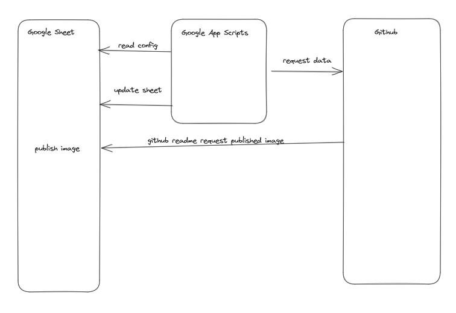

# GitHub Burndown Chart Generator

## Objective:
The GitHub Burndown Chart Generator aims to create a burndown chart from GitHub issues using Google Sheets through the power of Apps Script.

## 1. Take a copy of Google Sheet
Take a copy of the Burndown Google Sheet from [here](https://docs.google.com/spreadsheets/d/1gTMtb81DBfmPNpgBuIW8T_jtTSD5sqKeWvve1-_eX9E/edit?usp=sharing)

## 2. Create and store GITHUB_TOKEN:
1. Follow this guide to obtain your GitHub token: [GitHub - Managing your personal access tokens](https://docs.github.com/en/authentication/keeping-your-account-and-data-secure/managing-your-personal-access-tokens#personal-access-tokens-classic). For this script, you only need the `project: read:project` access.
    - This video provide step by step tutorial on generating github token [Youtube]https://www.youtube.com/watch?v=9lGcbQR4k4Y
2. In Apps Script, go to Project Settings -> Edit Script Properties.
3. Add a property named `GITHUB_TOKEN` and set its value as your GitHub token.

## 3. Create timed trigger
Create a timed event trigger in Google App Sheets, described here: https://developers.google.com/apps-script/guides/triggers/installable#time-driven_triggers

## Process


## Lessons Learned

### GitHub GraphQL API
The GitHub GraphQL API can be quite challenging, especially when fetching custom fields like "Status" and "Hours." It requires some exploration to use effectively.

One issue we encountered was fetching custom fields in GitHub v2 projects using `fieldValueByName(name: $field_name)`. However, this method proved problematic when attempting to fetch multiple custom fields simultaneously.

The solution was to use GraphQL aliases: [Using Aliases in GraphQL](https://blog.logrocket.com/using-aliases-graphql/).

```
hours: fieldValueByName(name: "Hours") {
... on ProjectV2ItemFieldSingleSelectValue {
    value: name
    }
}
status: fieldValueByName(name: "Status") {
    ... on ProjectV2ItemFieldSingleSelectValue {
        status: name
    }
}
```

This approach worked perfectly and also made processing the response easier.

### Google Apps Script

Setting up Apps Script was surprisingly straightforward. Although securing tokens remained challenging since users with edit access could see your GITHUB_TOKEN script properties. If you find a better way to handle this, feel free to message us. To prevent your GitHub token from being leaked, it's recommended to avoid sharing edit access with others.

There are some minor differences compared to regular JavaScript, like using `UrlFetchApp` for API requests. But for simple scripts, your code should mostly work out of the box with Google Apps Script.
